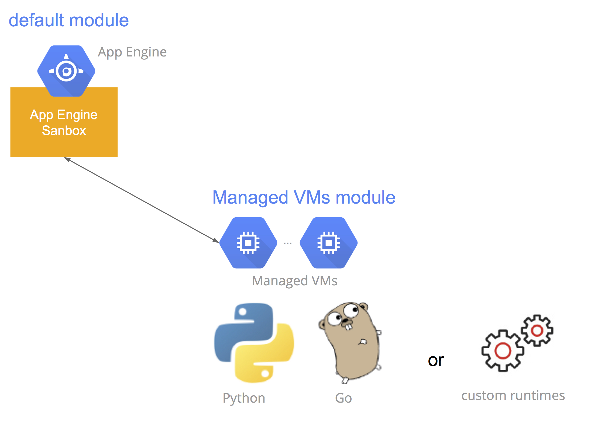

# GCP managed VMs lab

> Google Cloud Platform Managed VMs simple lab (Golang/Python)

[GAE Managed VM Introduction - Google Slides](https://goo.gl/SwuEvR) by cage.chung@gmail.com

## Demo Managed VMs artchietcture


_dispatch.yaml_

```yaml
dispatch:
  - url: "*/favicon.ico"
    module: default

  # appengine sanbox
  - url: "qnap-gcp-lab-003.appspot.com/"
    module: default

  # managed vms
  - url: "*/module1/*"
    module: module1

  - url: "*/*"
    module: default
```

本次 demo lab 的架構為一個 sanbox runtime(default module) + managed VMs(module1) with automatic scaling. Route request
可以透過 `dispatch.yaml` 的設定進行重導[1]


## Run locally

> 本次 Demo 使用 Google Cloud SDK 0.9.79

```sh
# install Google cloud SDK
$ curl https://sdk.cloud.google.com | bash

# update components
$ gcloud components update

# clone repo
$ git clone https://github.com/cage1016/managed-vms-lab

# run locally
$ cd golang (or cd python)

$ sh local_run.sh
```

## Deploy to GAE

在發佈 demo 應用程式至 App Engine 時，需要先配置一些參數. Golang/Python 的配置方式都一樣。

1. 重新命名 \*.yaml.exist --> \*.yaml
  - \*/default/`dispatch.yaml.exist` --> \*/default/`dispatch.yaml`
  - \*/default/`update_all.sh.exist` --> \*/defalt/`update_all.sh`
  - \*default/`create_ab_test_instances.sh.exist` --> \*/default/`create_ab_test_instances.sh`
2. 在發佈應用程式至 App Engine 之前，確認你有先在 [Google Developers Console](https://goo.gl/JkWVb9) 建立專案
3. 設置專案 `PROJECT_ID`
  - \*/default/dispatch.yaml
  - \*/default/update_all.sh
  - \*/create_ab_test_instances.sh
4. `$ sh update_all.sh` 就會依序發佈 App Engine sandbox 及 Managed VMs 至 App Engine
5. 訪問
  - default module: https://your-project-id.appspot.com/
  - module1: https://your-project-id.appspot.com/module1/
  - module1 route: https://your-project-id.appspot.com/module1/sayhi

# Reference
1. App Engine Module:
  - [App Engine Modules in Python](https://goo.gl/p3nl48)
  - [App Engine Modules in Go](https://goo.gl/KpdKpF)
